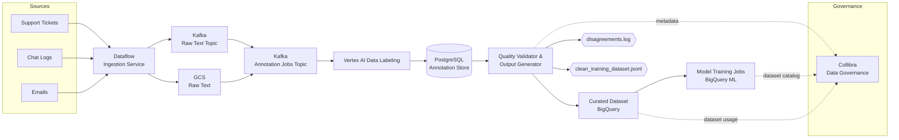

# Architecure Diagram

```mermaid
flowchart LR
    subgraph Sources
         A[Support Tickets]
         B[Chat Logs]
         C[Emails]
    end

    A & B & C --> I[Dataflow<br/>Ingestion Service]
    I --> O[GCS<br/>Raw Text]
    I --> K[Kafka<br/>Raw Text Topic]
   
    K --> Q[Kafka<br/>Annotation Jobs Topic]
    O --> Q

    Q --> U[Vertex AI Data Labeling]
    U --> P[(PostgreSQL<br/>Annotation Store)]

    P --> V[Quality Validator &<br/>Output Generator]
    V --> L[Curated Dataset<br/>BigQuery]
    V --> LOG{{disagreements.log}}
    V --> JSONL{{clean_training_dataset.jsonl}}

    L --> T[Model Training Jobs<br/>BigQuery ML]

    subgraph Governance
         CBG[Collibra<br/>Data Governance]
    end

    V -. metadata .-> CBG
    T -. dataset catalog .-> CBG
    L -. dataset usage .-> CBG
```